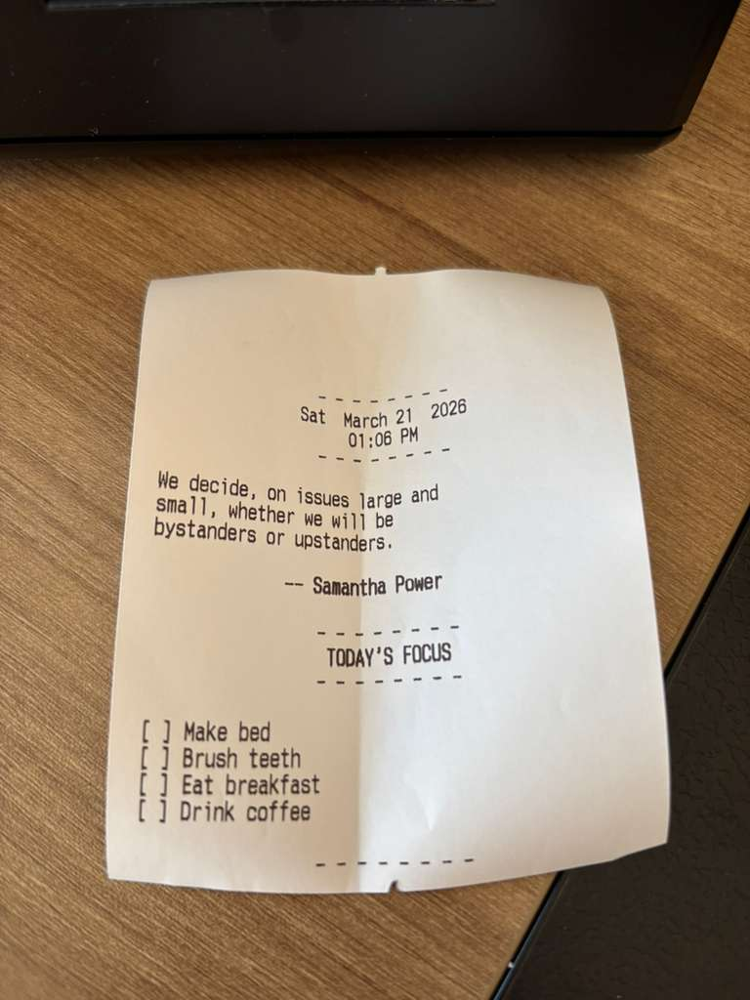

# POS: Personal Output System
An executive function assistant that prints a daily focus receipt on a thermal printer. Each receipt combines the current datetime, a randomly selected quote, and your pending to-do tasks for the day.

---

## First Run




---

## How to Use

**1. Add your tasks to `tasks_bank.txt`** — one task per line:
```
Make bed
Brush teeth
Eat breakfast
Drink coffee
Reply to emails
```

**2. Run the program:**
```bash
python main.py
```

This prints the full receipt: datetime, a random quote, and all pending tasks.

**3. Mark tasks complete** — when you finish a task, open `tasks_bank.txt` and add `[x]` in front of it:
```
[x] Make bed
[x] Brush teeth
Eat breakfast       ← still pending
Drink coffee        ← still pending
```

**4. Reprint anytime** — run `main.py` again and only the remaining tasks will print.

---

## Managing Quotes

Quotes are stored in `quotes_bank.py` as a dictionary organised by author.
```python
"Author Name": [
    "First quote here.",
    "Second quote here.",
],
```

Each time the program runs, one author and one of their quotes is selected at random.
